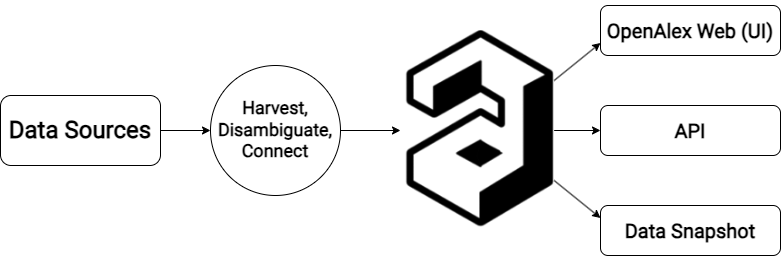

# How it works

<figure><figcaption></figcaption></figure>

OpenAlex is more than just a catalog of research publications. We do the work of _disambiguating_ and _connecting_ scholarly works, authors, institutions, sources, and other entities. We then offer the data and analytics on top of it in three different channels, depending on your needs:

* [**OpenAlex Web**](https://openalex.org) — Our friendly web user interface
* [**OpenAlex API**](../api.md) — A fast, modern REST API to get the data programmatically
* [**Data Snapshot**](https://docs.openalex.org/download-all-data/openalex-snapshot) — A periodic snapshot of the data, available to download in its entirety, for free

Start learning more about how OpenAlex works by reading our [entities-overview.md](entities-overview.md "mention")
